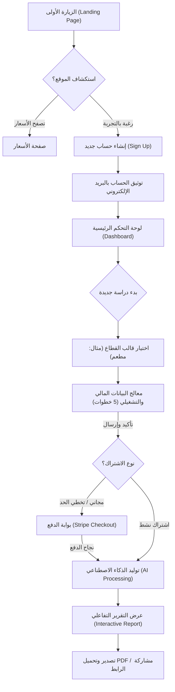

# وثيقة تدفقات رحلة المستخدم (User Experience Flows - UX)
## منصة Feasibility Suite - من الزيارة الأولى حتى تحميل التقرير

---

تستعرض هذه الوثيقة رحلة المستخدم الكاملة (**End-to-End User Journey**) داخل منصة **Feasibility Suite**، متضمنة خريطة التدفق البصري، التفاصيل التفصيلية لكل خطوة، وحالات التفرع والتعامل مع الأخطاء لضمان تجربة مستخدم سلسة وذات كفاءة تحويل عالية.

---

### 1. خريطة التدفق البصري (User Flow Map)

يوضح المخطط التالي المسار الذي يسلكه المستخدم منذ دخوله الموقع كزائر وحتى تنزيل دراسة الجدوى كملف PDF:

---

### 2. تفاصيل خطوات الرحلة (Journey Steps in Detail)

#### الخطوة 1: الاستكشاف والهبوط (Exploration & Hook)
* **المكان:** الصفحة الرئيسية (Landing Page).
* **هدف المستخدم:** معرفة ما إذا كانت الأداة مناسبة لقطاع مشروعه وفهم طريقة عملها وسعرها.
* **إجراءات النظام:** عرض عينة حية لدراسة مولدة سلفاً، وتوفير أزرار CTA واضحة ومباشرة.

#### الخطوة 2: التسجيل وتأكيد الهوية (Onboarding & Auth)
* **المكان:** صفحة التسجيل (Sign Up Page).
* **هدف المستخدم:** إنشاء مساحة عمل خاصة به لحفظ بيانات مشروعه.
* **إجراءات النظام:** توفير خيار التسجيل بضغطة زر واحدة عبر Google لحذف خطوات التسجيل الطويلة، أو بالبريد الإلكتروني مع إرسال كود التفعيل المباشر.

#### الخطوة 3: اختيار قطاع المشروع (Project Setup)
* **المكان:** لوحة تحكم العميل (User Dashboard).
* **هدف المستخدم:** اختيار قالب يطابق مشروعه.
* **إجراءات النظام:** تقديم قائمة قوالب مصنفة (متاجر، مطاعم، تكنولوجيا، خدمات)، مع توفير محرك بحث داخلي للقوالب.

#### الخطوة 4: تعبئة معالج البيانات (Interactive Wizard)
* **المكان:** معالج إعداد الدراسة (Wizard Steps).
* **هدف المستخدم:** إدخال معطياته المالية دون الدخول في تفاصيل الحسابات الرياضية.
* **إجراءات النظام:** تقسيم الإدخال لـ 5 خطوات متتالية:
  1. معلومات عامة (الاسم، الموقع، العملة).
  2. دراسة السوق المبسطة (تحديد الفئة والمنافسين).
  3. التكاليف التأسيسية (رأس المال، الديكورات، التراخيص).
  4. المصاريف التشغيلية (الرواتب، الإيجار، التسويق).
  5. الإيرادات المتوقعة (متوسط قيمة الطلبات والكميات الشهرية).

#### الخطوة 5: المعالجة والانتظار (Processing State)
* **المكان:** شاشة الانتظار التفاعلية (Loading Screen).
* **هدف المستخدم:** معرفة أن النظام يقوم بالتحليل المالي واستدعاء الذكاء الاصطناعي.
* **إجراءات النظام:** عرض مؤشر تقدم دائري (Spinner) مصحوب بعبارات متغيرة تفيد المستخدم بما يتم الآن (مثال: "يتم احتساب نقطة التعادل..."، "الذكاء الاصطناعي يصيغ تحليل SWOT حالياً...") لتقليل الشعور بالانتظار وتفادي الخروج من الصفحة.

#### الخطوة 6: استعراض التقرير المالي والتصدير (Interactive Report & Export)
* **المكان:** صفحة التقرير النهائي (Report Dashboard).
* **هدف المستخدم:** مراجعة التحليلات والرسوم البيانية وتنزيل النسخة المطبوعة.
* **إجراءات النظام:** عرض النتائج بطريقة بصرية أنيقة، توفير أزرار لتحديث الأرقام على الطاير، وزر مخصص لتحميل ملف الـ PDF فورياً.

---

### 3. مسارات التعامل مع الأخطاء والعقبات (Error Recovery Flows)

#### أ. فشل عملية الدفع عبر Stripe (Payment Failed Flow)
* **الحدث:** العميل يدخل بطاقة ائتمانية مرفوضة.
* **مسار المعالجة:**
  1. يتم الاحتفاظ بجميع مدخلات معالج البيانات في جلسة المستخدم (Session/Database State).
  2. يُعاد توجيه العميل لصفحة الأسعار مع تنبيه أحمر: "فشلت عملية الدفع، يرجى المحاولة ببطاقة أخرى".
  3. يظل زر "أكمل دراستك المحفوظة" نشطاً في لوحة التحكم حتى لا يضطر المستخدم لإعادة ملء البيانات من الصفر.

#### ب. استجابة غير صالحة من الذكاء الاصطناعي (AI Generation Timeout/Failure)
* **الحدث:** حدوث بطء شديد أو انقطاع في خوادم OpenAI أثناء كتابة نصوص الدراسة.
* **مسار المعالجة:**
  1. تظهر واجهة خفيفة للمستخدم تفيد بوجود ضغط.
  2. يقوم محرك الخلفية بحساب وإعداد كافة التقارير والرسوم المالية تلقائياً أولاً وعرضها (حيث أنها لا تعتمد على الـ AI).
  3. يتم وضع نص مؤقت في خانة SWOT: "جاري صياغة النص من قبل المساعد الذكي... انقر هنا لإعادة المحاولة" لضمان عدم توقف رحلة المستخدم بالكامل.
