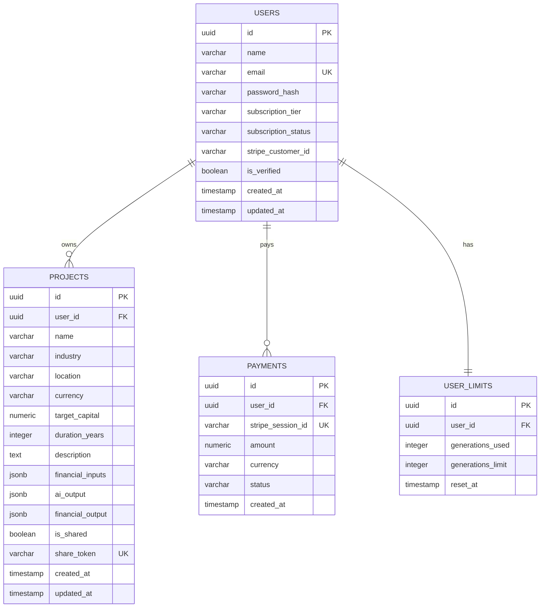

# وثيقة مخطط قاعدة البيانات (Database Schema Document)
## منصة SaaS الذكية لإنشاء دراسات الجدوى بالذكاء الاصطناعي (Feasibility Suite)

---

### 1. مخطط الكيانات والعلاقات النصي (Entity-Relationship Diagram - ERD)

تم بناء هيكل البيانات ليكون ترابطياً (Relational) بالكامل لضمان الاتساق والحماية للمعلومات المالية، مع استخدام حقول `JSONB` داخل جدول المشاريع لضمان مرونة تخزين مدخلات ومخرجات الذكاء الاصطناعي المتغيرة دون الحاجة لتغيير هيكل الجدول بشكل متكرر.

---

### 2. تفاصيل الجداول والأعمدة (Table Schemas)

#### 2.1 جدول المستخدمين (`users`)
يخزن البيانات الأساسية للمستخدمين وحالة اشتراكاتهم الحالية مع بوابة الدفع.

| اسم العمود (Column Name) | النوع التقني (Data Type) | القيود (Constraints) | الوصف |
| :--- | :--- | :--- | :--- |
| `id` | `UUID` | `PRIMARY KEY`, `DEFAULT gen_random_uuid()` | المعرف الفريد للمستخدم. |
| `name` | `VARCHAR(100)` | `NOT NULL` | الاسم الكامل للمستخدم. |
| `email` | `VARCHAR(255)` | `NOT NULL`, `UNIQUE` | البريد الإلكتروني (يُستخدم لتسجيل الدخول). |
| `password_hash` | `VARCHAR(255)` | `NOT NULL` | رمز كلمة المرور المشفرة بواسطة Bcrypt. |
| `subscription_tier` | `VARCHAR(20)` | `DEFAULT 'free'` | نوع الاشتراك الحالي (`free`, `basic`, `premium`). |
| `subscription_status`| `VARCHAR(20)` | `DEFAULT 'none'` | حالة الاشتراك المالي (`active`, `canceled`, `none`). |
| `stripe_customer_id` | `VARCHAR(100)` | `NULL` | معرف العميل في بوابة Stripe لتسهيل الخصم المتكرر. |
| `is_verified` | `BOOLEAN` | `DEFAULT FALSE` | حالة تأكيد الحساب وتوثيق البريد الإلكتروني. |
| `created_at` | `TIMESTAMP` | `DEFAULT CURRENT_TIMESTAMP` | وقت تسجيل الحساب. |
| `updated_at` | `TIMESTAMP` | `DEFAULT CURRENT_TIMESTAMP` | وقت آخر تعديل للحساب. |

---

#### 2.2 جدول دراسات الجدوى والمشاريع (`projects`)
يخزن تفاصيل المشاريع ومدخلاتها ومخرجاتها المحتسبة وتلك التي يولدها الذكاء الاصطناعي.

| اسم العمود (Column Name) | النوع التقني (Data Type) | القيود (Constraints) | الوصف |
| :--- | :--- | :--- | :--- |
| `id` | `UUID` | `PRIMARY KEY`, `DEFAULT gen_random_uuid()` | المعرف الفريد للمشروع. |
| `user_id` | `UUID` | `FOREIGN KEY` references `users(id)` `ON DELETE CASCADE` | المعرف الخاص بصاحب المشروع. |
| `name` | `VARCHAR(150)` | `NOT NULL` | اسم المشروع (مثال: متجر هدايا). |
| `industry` | `VARCHAR(50)` | `NOT NULL` | قطاع المشروع (مثال: `e-commerce`, `restaurant`). |
| `location` | `VARCHAR(100)` | `NOT NULL` | الموقع الجغرافي المستهدف (الدولة والمدينة). |
| `currency` | `VARCHAR(3)` | `DEFAULT 'USD'` | العملة المعتمدة في التحليل المالي (مثال: `SAR`, `AED`). |
| `target_capital` | `NUMERIC(15, 2)`| `NOT NULL` | رأس المال المستهدف لبدء التشغيل. |
| `duration_years` | `INTEGER` | `DEFAULT 3` | عدد سنوات التنبؤ المالي للمشروع (عادة 3 أو 5 سنوات). |
| `description` | `TEXT` | `NOT NULL` | وصف مختصر ومقروء لفكرة المشروع والخدمات. |
| `financial_inputs` | `JSONB` | `NOT NULL` | المدخلات المالية التفصيلية (رواتب، إيجار، تسويق، إلخ). |
| `ai_output` | `JSONB` | `NULL` | التحليلات المولدة بالذكاء الاصطناعي (SWOT، منافسون). |
| `financial_output` | `JSONB` | `NULL` | مخرجات العمليات الحسابية (فترة الاسترداد، صافي الأرباح). |
| `is_shared` | `BOOLEAN` | `DEFAULT FALSE` | هل الدراسة عامة ويمكن لغير المسجلين رؤيتها؟ |
| `share_token` | `VARCHAR(100)` | `UNIQUE`, `NULL` | التوكن الفريد المستخدم في رابط المشاركة العام. |
| `created_at` | `TIMESTAMP` | `DEFAULT CURRENT_TIMESTAMP` | تاريخ إنشاء الدراسة. |
| `updated_at` | `TIMESTAMP` | `DEFAULT CURRENT_TIMESTAMP` | تاريخ آخر تحديث للبيانات. |

---

#### 2.3 جدول عمليات الدفع الفردية والاشتراكات (`payments`)
يخزن سجل المعاملات المالية المكتملة عبر بوابة الدفع الإلكتروني.

| اسم العمود (Column Name) | النوع التقني (Data Type) | القيود (Constraints) | الوصف |
| :--- | :--- | :--- | :--- |
| `id` | `UUID` | `PRIMARY KEY`, `DEFAULT gen_random_uuid()` | معرف المعاملة الفريد داخل المنصة. |
| `user_id` | `UUID` | `FOREIGN KEY` references `users(id)` | معرف المستخدم الذي قام بالدفع. |
| `stripe_session_id` | `VARCHAR(255)` | `NOT NULL`, `UNIQUE` | المعرف الخاص بالمعاملة على Stripe للتحقق والتتبع. |
| `amount` | `NUMERIC(10, 2)`| `NOT NULL` | القيمة الإجمالية المدفوعة. |
| `currency` | `VARCHAR(3)` | `NOT NULL` | عملة الدفع. |
| `status` | `VARCHAR(50)` | `NOT NULL` | حالة الدفع الحالية (مثال: `paid`, `pending`, `failed`). |
| `created_at` | `TIMESTAMP` | `DEFAULT CURRENT_TIMESTAMP` | وقت إتمام الدفع. |

---

#### 2.4 جدول ليميت الاستخدام (`user_limits`)
يتتبع حجم الاستهلاك الشهري للـ APIs والذكاء الاصطناعي لكل مستخدم بناءً على خطته لمنع الاستغلال المفرط.

| اسم العمود (Column Name) | النوع التقني (Data Type) | القيود (Constraints) | الوصف |
| :--- | :--- | :--- | :--- |
| `id` | `UUID` | `PRIMARY KEY`, `DEFAULT gen_random_uuid()` | المعرف الفريد. |
| `user_id` | `UUID` | `FOREIGN KEY` references `users(id)` `ON DELETE CASCADE`, `UNIQUE` | مستخدم واحد له سجل حدود استهلاك واحد. |
| `generations_used` | `INTEGER` | `DEFAULT 0` | عدد دراسات الجدوى التي تم توليدها خلال الشهر الجاري. |
| `generations_limit`| `INTEGER` | `DEFAULT 1` | الحد الأقصى للدراسات المسموح بتوليدها شهرياً للمستخدم. |
| `reset_at` | `TIMESTAMP` | `NOT NULL` | تاريخ تصفير العداد وتجديده (بداية الشهر القادم للعميل). |
