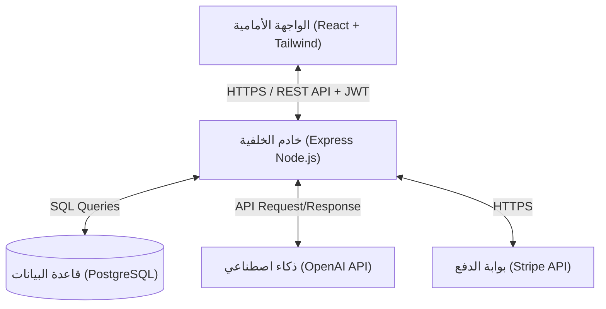

# وثيقة المواصفات التقنية (Technical Specifications)
## منصة SaaS الذكية لإنشاء دراسات الجدوى بالذكاء الاصطناعي (Feasibility Suite)

---

### 1. مبررات اختيار التقنيات (Technology Stack Rationale)

تم اختيار بنية التقنيات بناءً على معايير الأداء، سرعة التطوير (Time to Market)، وقابلية التوسع (Scalability):

| التقنية | الدور في المشروع | مبرر الاختيار |
| :--- | :--- | :--- |
| **React.js (Vite)** | Frontend Framework | توفر تجربة مستخدم ديناميكية وتفاعلية (SPA). متوافقة مع المكتبات الرسومية وتتميز بوجود نظام بيئي ضخم وسرعة بناء عالية باستخدام Vite. |
| **Tailwind CSS** | Styling Engine | تسريع عملية التصميم، وتوحيد عناصر الواجهة البرمجية (UI Design System)، وضمان استجابة كاملة مع الأجهزة المحمولة مع الاحتفاظ بحجم ملفات صغير. |
| **Node.js (Express)** | Backend Engine | معالجة الطلبات بكفاءة عالية بفضل بنية الإدخال/الإخراج غير الحاصرة (Non-blocking I/O). توحيد اللغة البرمجية (JavaScript) بين الواجهة الأمامية والخلفية. |
| **PostgreSQL** | Relational Database | تضمن سلامة البيانات المالية والترابطية (ACID Compliance). تدعم حقول `JSONB` مما يسمح بتخزين بيانات دراسات الجدوى المرنة وغير المهيكلة مع أداء استعلام سريع. |
| **JWT** | Authentication | آلية Stateless لإدارة الجلسات وتأمين الـ APIs، مما يسهل توزيع الأحمال وتوسيع النظام لاحقاً دون الحاجة لتخزين الجلسات في خوادم Backend. |
| **OpenAI API** | AI & LLM Engine | الوصول إلى أقوى نماذج معالجة اللغة (مثل GPT-4o) للحصول على تحليلات سوقية ذكية ونصوص احترافية وداعمة للغة العربية، مع ميزة توليد مخرجات بهيكل JSON محدد (Structured Outputs). |
| **Vercel** | Frontend Hosting | استضافة سريعة مدعومة بشبكة توصيل محتوى (CDN) عالمية، مع تكامل مباشر مع مستودع GitHub للنشر التلقائي (CI/CD). |
| **Render** | Backend Hosting | منصة سحابية سهلة الإعداد لإطلاق خوادم Node.js وقواعد بيانات PostgreSQL مع إدارة شهادات SSL وتوسيع الموارد بنقرة واحدة. |

---

### 2. معمارية النظام (System Architecture)

تتبع المنصة معمارية **Decoupled Client-Server Architecture**، حيث تنفصل الواجهة الأمامية تماماً عن الخلفية وتتواصل معها عبر طلبات HTTP RESTful APIs آمنة.



#### تدفق البيانات الرئيسي (Core Data Flow):
1. يرسل المستخدم طلب إنشاء دراسة جدوى من **Client** متضمناً مدخلات المشروع والـ JWT token.
2. يتحقق الـ **Backend** من صلاحية الـ JWT ويقوم بفلترة وتدقيق المدخلات.
3. يرسل الـ **Backend** طلباً إلى **OpenAI API** يحتوي على Prompt مهيأ ومخصص للحصول على تحليل السوق ونقاط القوة والضعف بصيغة JSON.
4. يستقبل الـ **Backend** استجابة الذكاء الاصطناعي، ويدمجها مع الحسابات المالية التي يقوم بها محرك العمليات الرياضية الخاص بالمنصة.
5. يحفظ الـ **Backend** الدراسة الناتجة في **PostgreSQL**.
6. يعيد الـ **Backend** النتائج إلى الـ **Client** لعرضها في لوحة تحكم تفاعلية للمستخدم.

---

### 3. هيكل مجلدات المشروع (Project Directory Structure)

تم اعتماد هيكل مجلدات موحد لتسهيل العمل في بيئة Monorepo مبسطة أو مستودعين منفصلين:

```
feasibility-suite/
├── client/                 # واجهة المستخدم (React App)
│   ├── public/             # الأصول العامة (Icons, Logos)
│   ├── src/
│   │   ├── assets/         # الصور والملفات الرسومية المشتركة
│   │   ├── components/     # المكونات القابلة لإعادة الاستخدام (UI, Buttons, Inputs)
│   │   ├── context/        # سياقات العمل العامة (مثل AuthContext)
│   │   ├── hooks/          # الخطافات المخصصة (Custom Hooks)
│   │   ├── layouts/        # تصاميم الصفحات الرئيسية (Sidebar Layout, Full Width)
│   │   ├── pages/          # مكونات الصفحات الكاملة (Dashboard, Login, Wizard)
│   │   ├── services/       # دوال الاتصال بالـ API (Axios Instances)
│   │   ├── store/          # إدارة الحالة (Zustand Store)
│   │   ├── utils/          # دوال المساعدة وتنسيق العملات والتواريخ
│   │   ├── App.jsx
│   │   └── main.jsx
│   ├── index.html
│   ├── tailwind.config.js
│   ├── vite.config.js
│   └── package.json
│
├── server/                 # خادم التطبيق (Node.js Express API)
│   ├── src/
│   │   ├── config/         # إعدادات قاعدة البيانات والـ APIs الخارجية
│   │   ├── controllers/    # منطق التحكم بالطلبات والاستجابات (Controllers)
│   │   ├── middlewares/    # برمجيات وسيطة للتأمين والتحقق (Auth, Rate Limiting)
│   │   ├── models/         # تعريف هيكل الجداول وعلاقات قاعدة البيانات (ORM/Prisma Schema)
│   │   ├── routes/         # مسارات الـ API (Auth Routes, Project Routes)
│   │   ├── services/       # منطق العمليات الخارجية (OpenAI Service, Finance Engine)
│   │   ├── utils/          # دوال المساعدة ومعالجة الأخطاء
│   │   └── app.js
│   ├── prisma/             # ملفات إعداد قاعدة البيانات والـ Migrations (في حال استخدام Prisma)
│   │   └── schema.prisma
│   ├── .env.example
│   ├── package.json
│   └── server.js
└── docs/                   # وثائق المشروع
```

---

### 4. حزم العمل المطلوبة (npm packages)

#### حزم الواجهة الأمامية (Frontend - `client/package.json`)
* **`react-router-dom@^6.22.0`**: لإدارة التنقل والمسارات داخل التطبيق.
* **`axios@^1.6.7`**: لإرسال طلبات الـ HTTP للخادم.
* **`lucide-react@^0.330.0`**: لتوفير مكتبة أيقونات عصرية ومتناسقة.
* **`zustand@^4.5.1`**: لإدارة حالة التطبيق (State Management) بشكل خفيف وسريع.
* **`recharts@^2.12.0`**: لبناء الرسوم البيانية التفاعلية للتدفقات المالية ونقطة التعادل.
* **`jwt-decode@^4.0.0`**: لفك تشفير الـ Token وقراءة بيانات المستخدم محلياً.

#### حزم الخلفية (Backend - `server/package.json`)
* **`express@^4.18.2`**: إطار العمل الأساسي للـ API.
* **`pg@^8.11.3`**: واجهة الاتصال بقاعدة بيانات PostgreSQL.
* **`@prisma/client@^5.10.2` & `prisma@^5.10.2`**: كأداة ORM لتسريع وتأمين التعامل مع قواعد البيانات.
* **`jsonwebtoken@^9.0.2`**: لإنشاء والتحقق من رموز الـ JWT.
* **`bcryptjs@^2.4.3`**: لتشفير كلمات المرور قبل تخزينها في قاعدة البيانات.
* **`dotenv@^16.4.5`**: لإدارة متغيرات البيئة.
* **`cors@^2.8.5`**: للسماح بالطلبات القادمة من نطاق الواجهة الأمامية فقط.
* **`openai@^4.28.0`**: المكتبة الرسمية للاتصال بالذكاء الاصطناعي الخاص بـ OpenAI.
* **`helmet@^7.1.0`**: لتأمين رؤوس طلبات الـ HTTP (Security Headers).
* **`express-rate-limit@^7.1.5`**: لحماية الـ APIs من هجمات الإغراق (DDoS & Brute Force).
* **`zod@^3.22.4`**: للتحقق من صحة البيانات المدخلة وتدقيق أنواعها (Data Validation).

---

### 5. ملفات إعداد البيئة (.env.example)

#### بيئة الواجهة الأمامية (`client/.env.example`)
```bash
# رابط الـ API الخاص بالخلفية
VITE_API_URL=http://localhost:5000/api/v1
```

#### بيئة الخلفية (`server/.env.example`)
```bash
# إعدادات تشغيل الخادم
PORT=5000
NODE_ENV=development

# قاعدة البيانات (PostgreSQL Connection String)
DATABASE_URL="postgresql://username:<REDACTED>@localhost:5432/feasibility_db?schema=public"

# مفتاح تشفير JWT وزمن انتهاء الصلاحية
JWT_SECRET=<REDACTED>
JWT_EXPIRES_IN=7d

# مفتاح الوصول إلى OpenAI
OPENAI_API_KEY=<REDACTED>

# مفتاح الدفع الرقمي Stripe
STRIPE_SECRET_KEY=<REDACTED>
STRIPE_WEBHOOK_SECRET=<REDACTED>

# النطاق المسموح له بطلب الـ API (للحماية من CORS)
CLIENT_URL=http://localhost:5173
```

---

### 6. القرارات التصميمية والبدائل (Design Decisions & Alternatives)

#### القرار الأول: فصل الواجهة الأمامية عن الخلفية (Decoupled Single Page App)
* **البديل المرفوض:** استخدام خوادم مدمجة مثل Next.js لتطبيق Full-Stack واحد.
* **سبب الرفض:** على الرغم من أن Next.js رائع، إلا أن فصل React عن Node.js يعطي مرونة أكبر للفريق في استضافة وإعادة تشغيل واجهات الـ API على خوادم ذات قوة معالجة مخصصة للمهام الثقيلة (مثل معالجة الذكاء الاصطناعي وبناء التقارير المالية)، كما يسهل عملية بناء تطبيقات هواتف ذكية (Mobile App) لاحقاً والاتصال بنفس الـ API دون تعديل.

#### القرار الثاني: استخدام PostgreSQL مع حقول JSONB
* **البديل المرفوض:** استخدام MongoDB كقاعدة بيانات غير ترابطية لتسهيل تخزين دراسات الجدوى المتنوعة.
* **سبب الرفض:** النظام المالي والاشتراكات والمدفوعات يتطلب مرونة ترابطية وسلامة بيانات عالية جداً (ACID)، وهو ما يفتقده الـ NoSQL بطبيعته مقارنة بالـ SQL. دمج PostgreSQL مع حقل من نوع `JSONB` لتخزين مخرجات الـ AI أعطانا أفضل ما في العالمين: الحفاظ على العلاقات المالية والاشتراكات بسلامة كاملة، ومرونة التخزين للنصوص التحليلية الكبيرة المتغيرة.

#### القرار الثالث: اعتماد Zustand لإدارة الحالة في React
* **البديل المرفوض:** Redux Toolkit (RTK).
* **سبب الرفض:** يحتوي Redux على الكثير من الأكواد المكررة والتعقيد الإضافي (Boilerplate) الذي لا تحتاجه المنصة في مرحلة الـ MVP. يوفر Zustand واجهة أبسط بكثير وأداء أفضل مع حجم حزمة صغير، مما يسرع وتيرة التطوير.
